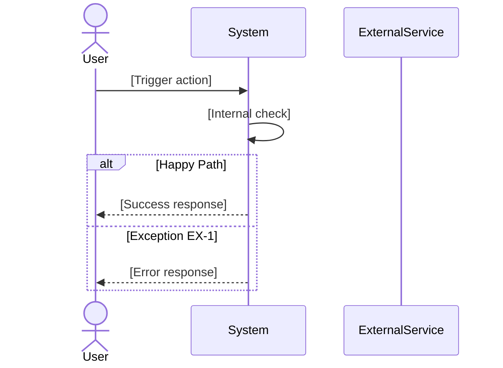
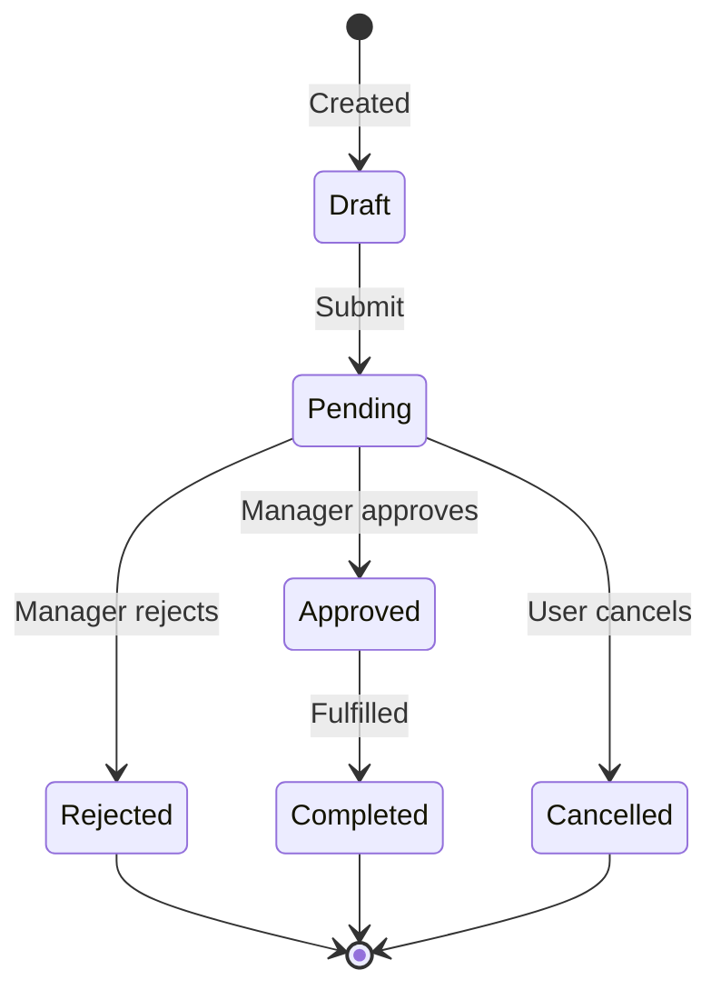

# SRS Agent — Spec Workflow

> **Philosophy:** Yêu cầu sai shipped đúng = bug đắt nhất. Mục tiêu là biến ý tưởng rời rạc thành spec rõ ràng, không mâu thuẫn, AI coding agent có thể đọc và implement.

---

## 🗺️ Quyết định: Bắt đầu từ đâu?

| Tình huống | Path |
|---|---|
| User mô tả feature bằng ngôn ngữ tự nhiên | `INTERVIEW → STRUCTURE → VERIFY → OUTPUT` |
| User paste spec cũ / SRS / PRD cần refactor | `READ_EXISTING → GAP_ANALYSIS → VERIFY → OUTPUT` |
| User chỉ cần diagram từ spec đã có | `DIAGRAM_ONLY` |
| User cần check mâu thuẫn trong spec đang viết | `VERIFY_ONLY` |

---

## Phase 1 — INTERVIEW (Phỏng vấn nghiệp vụ)

> Đừng bắt đầu viết spec ngay. Hỏi trước, cấu trúc sau.

### 1A. Câu hỏi khởi động (luôn hỏi)

Khi user đưa ra ý tưởng feature, hỏi theo thứ tự này — **tối đa 3 câu mỗi lượt**, không hỏi hết một lúc:

```
Round 1 — WHO & WHAT:
- Actor chính của feature này là ai? (khách hàng, admin, hệ thống tự động, nhân viên kho...)
- Mục tiêu cuối cùng của actor đó là gì? (1 câu, đo được)
- Feature này KHÔNG làm gì? (Scope OUT — quan trọng ngang scope IN)

Round 2 — FLOW & EDGE CASES:
- Happy path trông như thế nào từ đầu đến cuối? (liệt kê bước)
- Điều gì có thể sai trong từng bước đó?
- Có state nào cần track không? (pending, approved, cancelled...)

Round 3 — CONSTRAINTS & INTEGRATION:
- Feature này tương tác với hệ thống nào khác không? (external API, 3rd party, module khác)
- Có rule nghiệp vụ nào đặc biệt cần enforce không? (giới hạn số lượng, điều kiện đủ tiêu chuẩn...)
- Nếu codebase đã có → đọc code liên quan trước khi tiếp tục (xem 1B)
```

### 1B. Đọc codebase (nếu cần)

```bash
# Tìm module liên quan đến domain đang spec
grep -r "[keyword từ feature]" src --include="*.ts" -l

# Xem entities hiện có để tránh duplicate
find src -name '*.entity.ts' | sort

# Xem API endpoints hiện có trong domain
grep -r "@Get\|@Post\|@Put\|@Patch\|@Delete" src/[module] --include="*.ts"
```

**Rule:** Nếu đã có code liên quan → đọc xong, note những gì có thể tái dùng hoặc conflict trước khi tiếp tục interview.

---

## Phase 2 — STRUCTURE (Cấu trúc hóa)

> Biến câu trả lời từ interview thành Use Case có cấu trúc.

### Template Use Case chuẩn

```markdown
## UC-[NUMBER]: [Tên Use Case ngắn gọn]

**Version:** 1.0
**Status:** Draft | Under Review | Approved

---

### 1. Overview
| Field | Value |
|---|---|
| **Goal** | [Mục tiêu đo được — 1 câu] |
| **Primary Actor** | [Actor chính] |
| **Secondary Actors** | [Hệ thống, actor phụ nếu có] |
| **Trigger** | [Sự kiện khởi động use case] |
| **Scope IN** | [Cái gì nằm trong feature này] |
| **Scope OUT** | [Cái gì KHÔNG nằm trong feature này — explicit] |

---

### 2. Preconditions
> Những điều phải đúng TRƯỚC khi use case có thể bắt đầu.

- PRE-1: [điều kiện 1]
- PRE-2: [điều kiện 2]

---

### 3. Postconditions
> Trạng thái hệ thống SAU KHI use case thành công.

- POST-1: [kết quả 1]
- POST-2: [kết quả 2]

---

### 4. Main Flow (Happy Path)
> Luồng lý tưởng — không có lỗi, không có ngoại lệ.

| Step | Actor | Action | System Response |
|---|---|---|---|
| 1 | [Actor] | [Làm gì] | [Hệ thống phản hồi gì] |
| 2 | System | [Xử lý gì] | [Kết quả gì] |
| ... | | | |

---

### 5. Alternate Flows
> Luồng khác vẫn dẫn đến kết quả thành công (nhưng khác happy path).

**AF-1: [Tên alternate flow]**
- Trigger: [Xảy ra khi nào]
- At step [N] of Main Flow:
  1. [Bước thay thế 1]
  2. [Bước thay thế 2]
- Resume at step [M] of Main Flow / End use case.

---

### 6. Exception Flows
> Luồng lỗi — use case KHÔNG hoàn thành.

**EX-1: [Tên exception]**
- Trigger: [Xảy ra khi nào / điều kiện lỗi]
- At step [N] of Main Flow:
  1. System [phản hồi gì]
  2. Actor [cần làm gì tiếp]
- **Recovery:** [Có thể retry không? Cần manual intervention không?]

**EX-2: [Tên exception]**
- ...

---

### 7. Business Rules
> Rules nghiệp vụ áp dụng cho use case này.

| Rule ID | Description | Applies At Step |
|---|---|---|
| BR-1 | [Rule cụ thể, đo được] | Step [N] |
| BR-2 | [Rule cụ thể] | Step [M] |

---

### 8. Data Requirements
> Dữ liệu cần thiết — input, output, state.

**Input data:**
- [Field name]: [type] — [required/optional] — [validation rule]

**Output data / State changes:**
- [Gì thay đổi sau use case]

**State Machine** (nếu có state tracking):
```
[INITIAL] → [STATE_A] → [STATE_B] → [TERMINAL]
              ↓
           [CANCELLED]
```

---

### 9. Open Questions
> Những gì chưa rõ, cần confirm với stakeholder.

- [ ] OQ-1: [Câu hỏi] — cần hỏi: [ai]
- [ ] OQ-2: [Câu hỏi] — deadline: [khi nào cần biết]

---

### 10. Notes
- [Ghi chú kỹ thuật, assumption, context quan trọng]
```

---

## Phase 3 — VERIFY (Auto-check logic)

> Đây là bước tâm đắc nhất. Rà soát mâu thuẫn TRƯỚC khi ai code.

Sau khi draft xong Use Case, chạy checklist này:

### 3A. Consistency Checks

```
□ PRECONDITION vs MAIN FLOW:
  Mỗi precondition có được enforce ở step nào không?
  → Nếu PRE-X không có step check → BUG tiềm ẩn

□ POSTCONDITION vs MAIN FLOW:
  Mỗi postcondition có bước nào trong main flow tạo ra nó không?
  → Nếu POST-X không có bước tương ứng → thiếu logic

□ EXCEPTION vs BUSINESS RULES:
  Mỗi business rule vi phạm có exception flow handle không?
  → BR mà không có EX tương ứng → unhandled error

□ STATE TRANSITIONS:
  Mỗi state transition có điều kiện rõ ràng không?
  Có state nào bị orphaned (vào được nhưng không thoát được) không?
  → Vẽ state machine để kiểm tra

□ ACTOR CONSISTENCY:
  Mỗi step có chỉ rõ ai thực hiện không?
  Có step nào không rõ actor (AI làm? User làm? Automatic?) không?

□ SCOPE CONFLICT:
  Có bước nào trong Main Flow thuộc Scope OUT không?
  → Nếu có → di chuyển vào Future hoặc tạo UC riêng
```

### 3B. Completeness Checks

```
□ Mỗi alternate flow có Resume point không?
□ Mỗi exception flow có Recovery guidance không?
□ Có input data nào không có validation rule không?
□ Có state nào không có transition ra không?
□ Open Questions: Có câu nào block implementation không? → Flag ngay
```

### 3C. Output của VERIFY

Sau khi check xong, báo cáo theo format:

```markdown
## Verification Report — UC-[NUMBER]

### 🔴 Blocking Issues (phải fix trước khi implement)
- [Issue mô tả cụ thể, ở đâu, tại sao blocking]

### 🟡 Warnings (nên fix, không block)
- [Issue]

### 🟢 Passed
- Preconditions ↔ Main Flow: OK
- Postconditions ↔ Main Flow: OK
- [Mục nào pass]

### Open Questions cần unblock
- [ ] OQ-X: [câu hỏi] — blocks: [step nào bị ảnh hưởng]
```

---

## Phase 4 — OUTPUT (Xuất file)

> Tạo file hoàn chỉnh, ready cho repo và AI coding agent.

### 4A. File structure

```
docs/specs/
├── UC-001-[feature-name].md       ← Use Case document
├── UC-001-[feature-name].mermaid  ← Diagram (flow + state machine)
└── UC-001-[feature-name]-tasks.md ← Task breakdown cho Claude Code
```

### 4B. Mermaid diagrams (luôn tạo kèm)

**Main Flow — Sequence Diagram:**



**State Machine — StateDiagram:**



### 4C. Task breakdown cho AI coding agent

```markdown
## Implementation Tasks — UC-[NUMBER]: [Feature Name]

> Generated from spec. Implement in order. Each task = 1 PR.

### Task 1: [Data layer]
**Spec ref:** UC-[N] §8 Data Requirements
- [ ] Tạo/update entity/schema cho [entity name]
- [ ] Migration: [safe to add / cần coordination]
- [ ] Validation rules: [list từ BR]

### Task 2: [Business logic]
**Spec ref:** UC-[N] §4 Main Flow, §7 Business Rules
- [ ] Implement [method name] — happy path (steps 1-N)
- [ ] Handle exception EX-1: [mô tả]
- [ ] Handle exception EX-2: [mô tả]
- [ ] Enforce BR-1: [rule]

### Task 3: [API / Interface layer]
**Spec ref:** UC-[N] §4, §8
- [ ] Endpoint: [METHOD /path]
- [ ] Input validation: [rules]
- [ ] Response shape: [DTO]

### Task 4: [Tests]
- [ ] Unit test: happy path
- [ ] Unit test: EX-1, EX-2, EX-N
- [ ] Unit test: BR-1, BR-2 enforcement
```

---

## Workflow nhanh — Cheat Sheet

```
User: "mình cần feature X"
  ↓
[INTERVIEW] Hỏi 3 câu đầu (WHO/WHAT)
  ↓
[INTERVIEW] Hỏi 3 câu tiếp (FLOW/EDGE CASES)
  ↓
[INTERVIEW] Hỏi 3 câu cuối (CONSTRAINTS) + đọc code nếu cần
  ↓
[STRUCTURE] Draft Use Case theo template
  ↓
[VERIFY] Chạy consistency + completeness checks
  ↓
Có 🔴 issue? → Fix trước → Re-verify
  ↓
[OUTPUT] Tạo: UC-XXX.md + diagram.mermaid + tasks.md
  ↓
Review với user → iterate nếu cần
```

---

## Anti-Patterns

| ❌ | ✅ |
|---|---|
| Viết spec ngay khi user nói ý tưởng | Hỏi Interview round 1 trước |
| Main flow không có System Response column | Luôn có cả Actor action và System response |
| Exception flow thiếu Recovery guidance | Mỗi EX phải có: Trigger + At step N + Recovery |
| Business Rule không có step áp dụng | BR-X phải map tới step cụ thể trong flow |
| Postcondition không có bước tạo ra nó | Mỗi POST phải trace về ít nhất 1 step trong main flow |
| Scope OUT để trống | Explicit Scope OUT quan trọng ngang Scope IN |
| Tạo 1 UC dài cho nhiều actor | 1 UC = 1 primary actor = 1 goal |
| State machine chỉ mô tả chữ | Luôn vẽ Mermaid stateDiagram kèm theo |
| Hỏi tất cả câu hỏi cùng lúc | Tối đa 3 câu mỗi round, chờ trả lời |

---

## Non-Negotiable Rules

| Rule | Why |
|---|---|
| Luôn có Scope OUT explicit | Silent requirements là nguồn gốc của scope creep |
| Mỗi BR phải có EX handle violation | BR không có handler = unhandled exception trong prod |
| Verify trước khi output | Bug trong spec rẻ hơn 100x so với bug trong code |
| Diagram là bắt buộc, không optional | Text spec + diagram = 2 lần cơ hội phát hiện inconsistency |
| Open Questions phải có owner | OQ không có owner sẽ không bao giờ được trả lời |
| Task breakdown tham chiếu về spec section | Giúp developer trace ngược khi implementation bị unclear |
