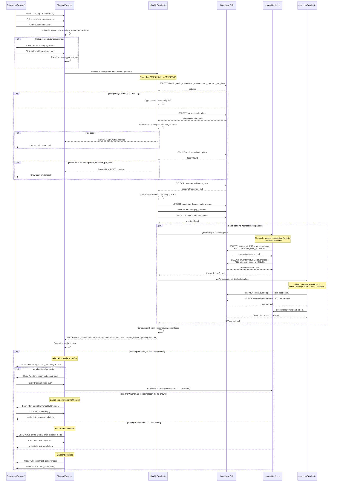
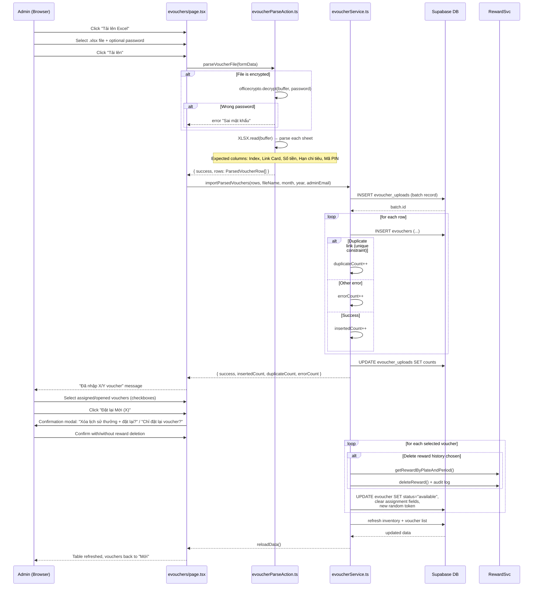

# Vision Energy — Sequence Diagrams

> Mermaid-based sequence diagrams visualizing the two core business flows.

---

## Flow A: Customer Check-in with Reward Notification

---

## Flow B: Admin Reward Management + E-Voucher Assignment

```mermaid
sequenceDiagram
    participant Admin as Admin (Browser)
    participant Leaderboard as leaderboard/page.tsx
    participant RewSvc as rewardService.ts
    participant CustSvc as customerService.ts
    participant VouchSvc as evoucherService.ts
    participant DB as Supabase DB
    participant CustPortal as Customer Portal (Browser)
    participant OCR as ocrAction.ts (Server)

    %% ── LOAD LEADERBOARD ──
    Admin->>Leaderboard: Select month/year, open Monthly tab
    Leaderboard->>RewSvc: getMonthlyLeaderboard(month, year)
    RewSvc->>CustSvc: getCustomerRankings({ type: "month", month, year })
    CustSvc->>DB: SELECT from charging_sessions WITH filter
    DB-->>CustSvc: sessions grouped by plate
    CustSvc-->>RewSvc: CustomerRanking[] (sorted, ranked)
    RewSvc->>DB: SELECT rewards for period
    DB-->>RewSvc: reward status per plate
    RewSvc-->>Leaderboard: LeaderboardEntry[] (ranked + enriched)

    Leaderboard->>VouchSvc: expireOverdueVouchers()
    Leaderboard->>VouchSvc: getAssignedVouchersForPeriod()
    VouchSvc->>DB: SELECT assigned evouchers
    DB-->>VouchSvc: EVoucher[]
    VouchSvc-->>Leaderboard: Map<plate, EVoucher>

    Leaderboard->>VouchSvc: getTierRules()
    VouchSvc->>DB: SELECT evoucher_tier_rules
    DB-->>VouchSvc: EVoucherTierRule[]
    VouchSvc-->>Leaderboard: rules
    Leaderboard-->>Admin: Render table with badges + assign controls

    %% ── ASSIGN E-VOUCHER ──
    Admin->>Leaderboard: Click "Gán" for a customer
    Note over Leaderboard: Uses tier-rule default or manual denomination pick
    Leaderboard->>VouchSvc: assignVoucher(plate, denom, month, year, rank, adminEmail)
    VouchSvc->>DB: SELECT oldest available voucher with denomination
    DB-->>VouchSvc: candidate.id
    VouchSvc->>DB: UPDATE evoucher SET status="assigned", assigned_plate=...,<br/>expiry=lastDayOfCurrentMonth
    alt Race: already taken
        DB-->>VouchSvc: null (row not found — another admin grabbed it)
        VouchSvc-->>Leaderboard: error "thử lại"
    else Success
        DB-->>VouchSvc: updated EVoucher
        VouchSvc-->>Leaderboard: { success, voucher }
    end
    Leaderboard-->>Admin: Refresh table

    %% ── GENERATE REWARD LINK ──
    Admin->>Leaderboard: Select customers (checkboxes)
    Admin->>Leaderboard: Click "Tạo link nhận thưởng"
    Leaderboard->>RewSvc: generateRewardTokens([{ plate, month, year, sessions }])
    RewSvc->>DB: INSERT rewards (status="eligible", random token)
    DB-->>RewSvc: inserted rows
    RewSvc-->>Leaderboard: { token, plate }[]
    Leaderboard-->>Admin: "Đã tạo X link!" alert

    %% ── BULK ASSIGN E-VOUCHER ──
    Admin->>Leaderboard: Click "Gán E-voucher hàng loạt"
    Leaderboard->>Leaderboard: Filter unassigned customers matching tier rules
    Leaderboard->>VouchSvc: loop: assignVoucher() for each candidate
    VouchSvc-->>Leaderboard: results
    Leaderboard-->>Admin: "Đã gán X/Y e-voucher"

    %% ── CUSTOMER CLAIMS REWARD ──
    Customer->>CustPortal: Open /rewards/{token} link
    CustPortal->>RewSvc: validateToken(token)
    RewSvc->>DB: SELECT reward by token
    DB-->>RewSvc: Reward | null
    RewSvc-->>CustPortal: { valid, reward, message }

    Note over CustPortal: Step 1: Verify Identity
    Customer->>CustPortal: Enter plate + phone
    CustPortal->>RewSvc: verifyIdentity(token, plate, phone)
    RewSvc->>DB: SELECT reward (match plate to token)
    RewSvc->>DB: SELECT customer (match phone to plate)
    DB-->>RewSvc: verified
    RewSvc-->>CustPortal: { verified: true }

    Note over CustPortal: Step 2: Capture CCCD + OCR
    Customer->>CustPortal: Upload/photo of CCCD
    CustPortal->>CustPortal: downsizeImage() — resize to 1600px
    CustPortal->>OCR: performOcr(formData with image)
    OCR->>PuterAI: POST gpt-4o-mini with base64 image
    alt Success
        PuterAI-->>OCR: JSON { full_name, id_number }
        OCR-->>CustPortal: { success, full_name, id_number }
    else Fail
        PuterAI-->>OCR: error
        OCR->>PuterAI: POST mistral (fallback)
        alt Still fail
            PuterAI-->>OCR: error
            OCR-->>CustPortal: { success: false }
            Note over CustPortal: Manual input fallback
        end
    end

    Note over CustPortal: Step 3: Review & Submit
    Customer->>CustPortal: Enter bank details + consent
    CustPortal->>RewSvc: uploadIdPhoto(file) → Supabase Storage
    RewSvc->>DB: INSERT into storage bucket "verification-docs"
    DB-->>RewSvc: storage path
    CustPortal->>RewSvc: submitRewardClaim({ token, id_name, id_number, photo_url, bank... })
    RewSvc->>DB: UPDATE rewards SET status="processing", bank info, OCR flag
    DB-->>RewSvc: updated row
    RewSvc-->>CustPortal: { success: true }
    CustPortal-->>Customer: "Gửi thành công!" screen

    %% ── ADMIN APPROVES ──
    Admin->>Leaderboard: Switch to "Lịch sử thưởng" tab
    Leaderboard->>RewSvc: getRewardsByPeriod(month, year)
    RewSvc->>DB: SELECT rewards WITH customers JOIN for period
    DB-->>RewSvc: RewardWithCustomer[]
    RewSvc-->>Leaderboard: enriched list
    Leaderboard-->>Admin: Show all rewards with status badges

    Admin->>Leaderboard: Click checkmark (approve) for a reward
    Leaderboard->>RewSvc: approveReward(rewardId, notes?)
    RewSvc->>DB: UPDATE rewards SET status="completed", rewarded_at=now()
    DB-->>RewSvc: success
    RewSvc-->>Leaderboard: { success: true }
    Leaderboard->>RewSvc: loadData() — refresh
    Admin->>Admin: Customer sees "completed" on next check-in

    %% ── CUSTOMER OPENS E-VOUCHER ──
    Customer->>CustPortal: Open /evouchers/{token}
    CustPortal->>VouchSvc: getVoucherByToken(token)
    VouchSvc->>DB: RPC get_evoucher_by_token(p_token)
    DB-->>VouchSvc: EVoucher | null
    VouchSvc-->>CustPortal: voucher
    Customer->>CustPortal: Click "Mở thẻ quà tặng"
    CustPortal->>VouchSvc: logOpen(token, userAgent)
    VouchSvc->>DB: RPC open_evoucher_by_token(p_token, p_user_agent)
    Note over VouchSvc: Atomic: flip assigned→opened<br/>bump open_count<br/>write audit log<br/>stamp reward.evoucher_opened_at
    DB-->>VouchSvc: updated EVoucher
    VouchSvc-->>CustPortal: { success, voucher }
    CustPortal->>Customer: window.open(voucher.link) → UrBox
```

---

## Flow C: Admin E-Voucher Upload & Reset

---

## Legend

| Shape | Meaning |
|-------|---------|
| Solid arrow `->>` | Function/method call |
| Dashed arrow `-->>` | Return value |
| `alt / else` | Conditional branch |
| `note over X` | Description of internal logic |
| `loop` | Iterative operation |
| `par` | Parallel operations |
