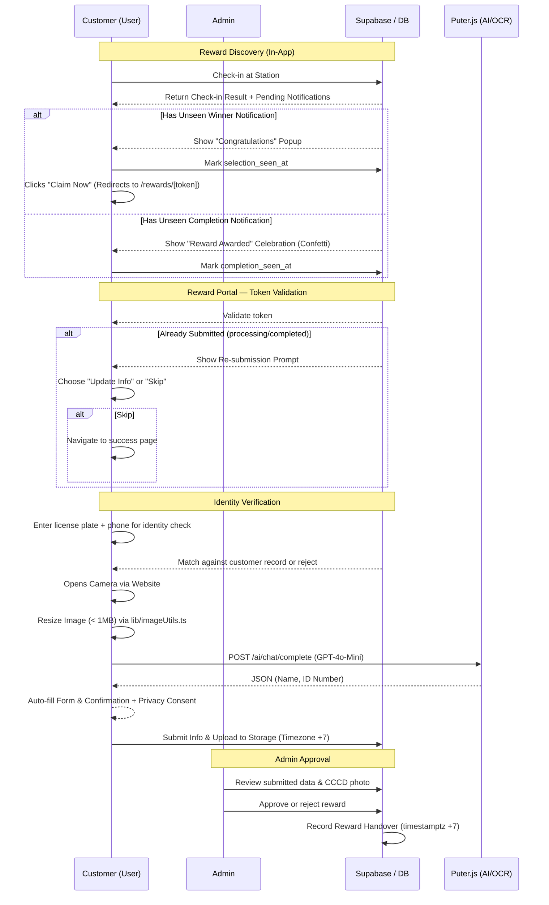

# Feature Design: Monthly Leaderboard & Rewards (OCR Verification)

## 1. Objective
Identify and reward the most active customers each month. The number of winners is **flexible** (admin selects from the leaderboard). The system enforces **Timezone +7 (ICT)**, prevents duplicate reward submissions, and verifies customer identity via license plate + phone number before collecting CCCD data.

---

## 2. User Flow

---

## 3. Technical Implementation

### Database Schema
- **Table `rewards`**:
    - `id` (UUID, PK)
    - `license_plate` (FK -> `customers.license_plate`, **NOT customer_id**)
    - `month`, `year` (Integers)
    - `checkin_count` (Integer — snapshot at reward time)
    - `id_card_photo_url` (Storage Path)
    - `id_full_name`, `id_number` (Extracted data)
    - `status` (`eligible` | `processing` | `completed` | `rejected`)
    - `is_ocr_verified` (Boolean)
    - `token` (Unique text — for customer portal URL)
    - `selection_seen_at` (timestamptz — for in-app Winner popup)
    - `completion_seen_at` (timestamptz — for in-app Success popup)
    - `rewarded_at` (**timestamptz, display +7**)
    - `created_at` (**timestamptz, default now(), display +7**)

> [!IMPORTANT]
> The FK references `license_plate` (the actual PK of `customers`), not a UUID `customer_id` which does not exist in the current schema.

### Data Integrity & Submission Guard
- **Unique Constraint**: `(license_plate, month, year)` — prevents duplicate rewards.
- **Unique Constraint**: `(token)` — ensures each portal link is unique.
- **Backend Check**: Service layer validates status before allowing writes.
- **Frontend Guard**: Submit button disabled after first click; portal shows "Already Submitted" on re-access.
- **Re-submission Support**: Users with `processing` or `completed` status see a prompt to update their info or skip.
- **Optimistic Concurrency**: Status updates use `.eq('status', 'expected_value')` to prevent race conditions.

### Identity Verification (Before OCR)
- Customer must enter their **license plate** and **phone number**.
- System cross-checks both against the `customers` table record linked to the reward token.
- If mismatch → access denied. This prevents someone with a shared link from claiming another's reward.

### Notification Strategy (100% In-App)
- No external broadcasting (Zalo/SMS) is used to simplify the process.
- **Discovery**: Users discover their reward purely through the check-in page at the physical station.
- **Persistence**: If a user misses the popup, they will see it again on their next check-in until they click "Claim" or the reward period expires.

---

## 4. UI Components

### Admin Leaderboard (`/app/admin/leaderboard`)
- **Tab 1 — Monthly Rankings**: Filter by month/year. Reuses existing `customerService.getCustomerRankings()`.
- **Tab 2 — All-Time Rankings**: Shows lifetime `total_points` from `customers` table.
- **Tab 3 — Reward History**: Detail table with status, dates, how many times each customer has been rewarded.
- **Action**: "Generate Reward Link" for selected users.
- **All timestamps displayed in UTC+7.**

### Customer Reward Portal (`/app/rewards/[token]`)
- **Public route** (no login required, protected by unique token).
- **Re-submission Prompt**: If user already submitted (status `processing` or `completed`), shows a popup with existing info and options to "Update" or "Skip".
- **Step 1**: Enter plate + phone → identity check.
- **Step 2**: Camera capture + Puter.js OCR (with manual fallback).
- **Step 3**: Review auto-filled data + privacy consent checkbox.

---

## 5. Security & Privacy
- **Identity Check**: Plate + phone verification before any sensitive data collection.
- **Token Security**: 36+ character random tokens to prevent brute-force guessing.
- **RLS**: `verification-docs` bucket accessible only to admin (read) and token-holder (write via signed URL).
- **Privacy Consent**: Explicit checkbox required before submission.
- **Data Retention**: ID photos archived/deleted after reward completion.
- **Timezone**: All business logic and display defaults to **UTC+7/ICT**.

---

## 6. Codebase Compatibility

| Existing File | Impact |
|---|---|
| `checkinService.ts` | **NONE** — No modifications |
| `customerService.ts` | **NONE** — Reused read-only |
| `sessionService.ts` | **NONE** — No modifications |
| `middleware.ts` | **NONE** — `/rewards/` is public |
| `customers` table | **NONE** — No schema changes |
| `charging_sessions` table | **NONE** — No schema changes |

---

## 7. Implementation File Map

| File | Purpose | Status |
|---|---|---|
| `lib/database/rewards-migration.sql` | SQL schema with RLS, indexes, constraints | ✅ Done |
| `lib/types/reward.ts` | TypeScript interfaces (no `any`) | ✅ Done |
| `lib/timezone.ts` | Vietnam +7 timezone utilities | ✅ Done |
| `app/services/rewardService.ts` | All business logic, identity verification, OCR flow | ✅ Done |
| `app/rewards/[token]/page.tsx` | Customer self-service portal | ✅ Done |
| `app/admin/leaderboard/page.tsx` | Admin dashboard (monthly, all-time, history) | ✅ Done |
